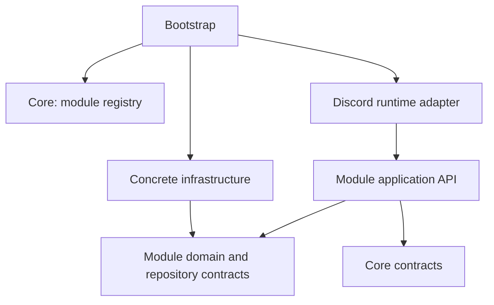

# Centerify architecture

Centerify is a Core-first modular monolith. One process hosts independently composed modules. Core supplies lifecycle, typed service registration, module configuration and application events. Features own their policies, storage contracts and Discord adapters.

## Assessment and migration

The original application used Sapphire discovery directories, global feature service instances and direct Prisma dependencies across services. Commands coordinated business policy and Discord responses. This made replacing storage or turning a feature off affect unrelated entrypoints.

The migration proceeded through a minimal Core, registry and lifecycle, the moderation warning workflow, validation of the module boundary, then the remaining features. Guild authorization, moderation and reports, XP, welcome and auto roles, custom commands, settings and information now register as modules. The old `services` and `lib/customCommands` layouts have been removed. The top-level `commands`, `listeners` and `preconditions` compatibility directories have also been removed. Commands, event handlers and preconditions live in their owning modules; production loads only their explicit contributions.

## Ownership and dependency direction

```text
src/core/                reusable platform contracts and lifecycle
src/modules/<feature>/  feature public API, policies, repositories and adapters
src/adapters/           shared Discord runtime, Prisma client and Pino integration
src/bootstrap/          selects modules and concrete implementations
src/index.ts            starts the application and handles process shutdown
```



Core never imports a module, Discord.js, Sapphire, Prisma or Pino. A feature that Centerify can operate without belongs in a module. Moderation cases, XP policy, custom-command validation and welcome templates are not Core concepts. Feature repository contracts remain in their owning modules. There is no generic database wrapper: the repository ports are the useful replacement boundaries.

Each module has an intentional `index.ts` business API. `discord/index.ts` is a separate public transport API; importing the business API does not load Discord or a database. Cross-module imports use these entrypoints. Inside a module, import private files directly to avoid barrel cycles. Bootstrap may import concrete infrastructure to compose implementations. Application and domain code never import transport or infrastructure code.

| Module | Owns | Required module |
| --- | --- | --- |
| `runtime` | Logger and application event-bus instances | None |
| `guilds` | Guild configuration storage and ownership verification | None |
| `moderation` | Cases, warnings, global moderation policy and reports | `guilds` |
| `xp` | Earning, cooldown/sharing policy and XP configuration | `guilds` |
| `welcome` | Welcome/goodbye templates and joining-member roles | `guilds` |
| `custom-commands` | Definitions, validation, execution, sharing and legacy responses | `guilds` |
| `settings` | Server settings presentation and configuration controls | `guilds` |
| `information` | Bot/server information presentation and repository metadata | `guilds` |

Discord-enabled modules additionally depend on `runtime`. Reports remain part of moderation because they use moderation history and review permissions. The existing log-channel setting remains guild configuration; a separate logging feature was not invented. The persisted guild configuration shape remains compatible with the existing database.

## Core API and lifecycle

`src/core/index.ts` exports `CenterifyModule`, `ModuleRegistry`, `ModuleContext`, `serviceToken`, `ServiceContainer`, `Logger`, `EventBus` and configuration parsing. Modules expose metadata (`id`, `name`, `version`, optional `dependsOn`) plus `register(context)`, optional `start()` and optional `stop()`.

1. Register the selected modules and their options.
2. `start()` validates duplicate IDs and the complete enabled dependency graph. Missing, disabled and circular dependencies fail clearly before registration executes.
3. All enabled modules register in dependency order. `context.provide` supplies a typed service; `resolve` consumes it. Duplicate providers fail. `contribute` supports several module-owned implementations of an extension contract.
4. After registration completes, `start` hooks run in dependency order.
5. Shutdown stops modules in reverse order and invokes their `onStop` disposers in reverse registration order. Startup failures also clean up the partially registered module. Cleanup continues after individual errors and reports aggregated failures.

The registry owns its service instances and contributions. There is no feature service singleton. Module factories are ordinary functions, so a second registry can use different repositories, loggers and behavior.

`register` should compose services and register cleanup immediately after acquiring resources. Start background work in `start`. Use `context.onStop(unsubscribe)` for event subscriptions and `context.onStop(() => clearInterval(timer))` for timers. Resolve required services from declared dependencies; registration order between unrelated modules is not an API.

## Configuration and disabling modules

`createApplication` in `bootstrap/application.ts` is the composition root. It accepts module options, replacement modules, additional modules, repositories, the database client and a logger. Unknown configured IDs and unknown replacement IDs fail early.

The executable reads `CENTERIFY_MODULES` as JSON:

```sh
CENTERIFY_MODULES='{"xp":false,"welcome":true,"custom-commands":{"enabled":true,"config":{"maxCommands":200,"maxLegacyResponses":40}}}'
```

Unspecified modules are enabled. Module configuration is passed as `unknown` only to its owner, which validates its own fields. Core has no feature-specific configuration fields. Per-server settings continue to use the existing persisted configuration through the guilds API.

Enable/disable selection takes effect on process startup. Disabled modules do not register services, commands, event handlers or background jobs. Settings controls for disabled features are hidden and stale interactions are rejected. A required dependent must also be disabled or removed. Hot unloading while requests are running is deliberately not provided; restart with the new selection.

Remove a module from the composition list to stop shipping its behavior, and remove dependents or optional UI integrations that consume its public API when deleting its source package. No Core change is needed. Add a Community or Premium package using the same contract and `additionalModules`; declare its dependencies on public APIs. No license or microservice platform is required.

## Discord integration

`withDiscord(module, loadAdapter)` combines a business module with a lazily loaded `DiscordModule`. The adapter contributes command classes, preconditions and typed `discordEvent` handlers. Sapphire's user-directory discovery is disabled. Its normal store loading and slash-command registration load the explicitly selected classes, preserving command names, options and permissions.

Command adapters parse input, acknowledge interactions, enforce Discord permissions and hierarchy, invoke application APIs, and present results. Discord role/member/channel objects stay at the transport edge. For example, `WarnMember.execute` receives IDs and values plus a small role-effects port; it owns count selection, case recording and assignment ordering. `GlobalModeration` owns participation and partial-failure policy. `ModerationCases` owns warning activity and revocation rules. XP, ownership, greeting planning, custom-command execution and sharing likewise use plain data and injected contracts.

Discord responses, embeds, component editors and Discord-specific checks remain in module `discord` code. Large information views contain presentation, rather than being promoted to Core services. Changing response formatting does not require a repository or domain change.

Event contributions at the same order run independently; one failure is logged without suppressing sibling handlers. Different orders run sequentially, preserving greeting-before-custom-member-event behavior. Message XP persistence cannot delay custom-command delivery. The adapter tracks active event and command executions during shutdown. Module-owned interaction collectors, warning timers and legacy cooldown state are disposed with their modules.

The `serviceRef` bridge is confined to Discord adapters. It resolves against the current application using asynchronous execution context and a client binding for collector callbacks. Application services use explicit constructor injection. Sapphire itself retains its framework container; feature state is not stored there.

## Replacing and customizing implementations

Pass a repository implementation to a module factory, or use `createApplication({ repositories: { moderation: replacement } })`. Replacing Prisma requires implementing the module ports and changing composition; use cases do not reference Prisma types. SQL atomicity, advisory locks, unique-constraint translation and transactions stay in infrastructure. Existing schema and historical migrations are unchanged.

Pass any implementation of the Core `Logger` contract as `createApplication({ logger })`; Pino is the default adapter. Replace Discord presentation by pairing the same business module with another `DiscordModule`. Replace a complete built-in through `replacements`, retaining its module ID and the public services required by dependents. Service tokens describe public behavior, so custom implementations do not need to inherit a base class. Moderation also accepts an optional `warnMember` implementation for focused overrides.

## Communication and extension

Use direct service calls for required operations and declare the dependency. Use the Core event bus for optional application notifications, with event payload contracts exported by their owner. `publish` awaits subscribers and propagates errors; it is an in-process mechanism with no durable delivery guarantee. Do not replace every method call with an event.

The contribution mechanism allows a module to define an extension contract without teaching Core about the feature. A module registers `context.contribute(token, value)` and an adapter or host consumes `registry.extensions(token)`. Discord registration uses this mechanism. Feature additions normally require a new module directory and one composition entry.

## Verification

`npm test` includes architecture checks for dependency direction, private cross-module imports, circular imports, infrastructure leaking into business code, and persistence imported by Discord presentation. It also checks module lifecycle rollback, isolated runtime installation and disabling modules. Pure use-case tests require no Discord login or PostgreSQL connection.

Run the repository scripts:

```sh
npm run typecheck
npm test
npm run build
TEST_DATABASE_URL=postgresql://... npm run test:database
TEST_DATABASE_URL=postgresql://... npm run test:e2e
```

There is no lint script. Database suites use unique synthetic guild records and clean them up; run them against a migrated development/test database. `check:discord` is a separate read-only live installation check requiring a Discord token. The architecture migration does not require logging the bot in or publishing commands to verify module composition.

See [Creating a module](creating-a-module.md) for a complete minimal example.
